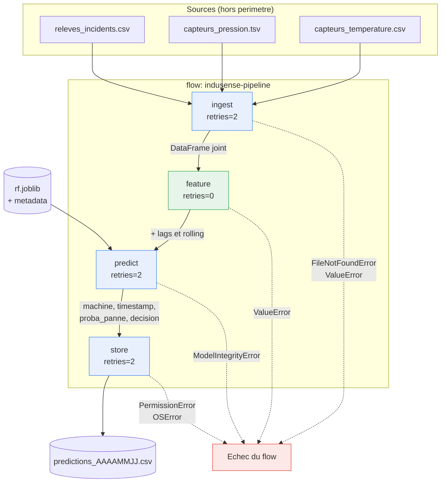

# Design du flow M29–M30

> Perimetre : `src/indusense/flows/pipeline.py`. Version analysee : `jalon/07`.
> Convention : ce fichier est ecrit sans accents, comme les autres documents de
> `docs/`, pour rester lisible quel que soit l'encodage du poste.

## Principe de decoupage

Une `@task` est l'unite de **re-execution**. Son decoupage decide de ce qu'on
peut rejouer sans tout refaire.

- Trop grosse : un echec tardif oblige a recommencer depuis le debut.
- Trop fine : le graphe devient illisible et le surcout d'orchestration domine.

Le decoupage retenu suit les **frontieres de responsabilite** :

| Task | Nature | Justification de la frontiere |
|---|---|---|
| `ingest` | I/O lecture | Seul point qui touche aux fichiers sources |
| `feature` | Calcul pur | Aucun effet de bord, donc rejouable sans risque |
| `predict` | I/O + calcul | Charge le modele (I/O) puis applique (calcul) |
| `store` | I/O ecriture | **Seul effet de bord** du pipeline |

Cette separation a une consequence concrete : `feature` est testable sans
disque, et `store` est le seul endroit ou l'idempotence se joue.

## Diagramme



Lecture du diagramme : les traits pleins portent les donnees, les pointilles
les erreurs. Les blocs verts sont purs, les bleus font des entrees-sorties.

## Contrats des tasks

| Task | Entree | Sortie | Effet de bord | Retry | Cle d'idempotence |
|---|---|---|---|---|---|
| `ingest` | `data_dir: Path`, `window_hours: int = 24` | `pd.DataFrame` (machine, timestamp, temperature, pressure_bar, panne) | Lecture seule | **2** (delai 5 s) | Aucune — lecture pure |
| `feature` | `dataset: pd.DataFrame` | `pd.DataFrame` + colonnes `<col>_lag<n>`, `<col>_roll<n>_mean` | **Aucun** | **0** | Aucune — fonction pure |
| `predict` | `features: pd.DataFrame`, `model_dir: Path`, `seuil: float` | `pd.DataFrame` (machine, timestamp, proba_panne, decision) | Lecture du modele | **2** (delai 5 s) | Aucune — lecture seule |
| `store` | `predictions: pd.DataFrame`, `output_dir: Path`, `run_date: datetime` | `Path` du fichier ecrit | **Ecriture disque** | **2** (delai 5 s) | **`run_date`** |

## Erreurs par task

| Task | Erreur | Nature | Faut-il rejouer ? |
|---|---|---|---|
| `ingest` | `FileNotFoundError` | Transitoire si montage reseau | **Oui** |
| `ingest` | `ValueError` (machine_id sans numero) | Deterministe — donnee malformee | Non, mais le retry est sans danger |
| `feature` | `ValueError` (colonne absente) | Deterministe — contrat rompu en amont | **Non** : `retries=0` assume |
| `predict` | `FileNotFoundError` (modele absent) | Transitoire au demarrage | **Oui** |
| `predict` | `ModelIntegrityError` | **Artefact compromis** | **Non** — voir `docs/threat_model.md` |
| `predict` | `ValueError` (features manquantes) | Deterministe | Non |
| `store` | `PermissionError` | Transitoire (verrou, montage) | **Oui** |
| `store` | `OSError` (disque plein) | Persistant | Sans effet, mais sans danger |

**Le point a discuter en seance** : `feature` porte `retries=0` alors que les
trois autres ont `retries=2`. Ce n'est pas un oubli. Une transformation pure
echoue de facon **deterministe** : la rejouer donne le meme echec, en retardant
le diagnostic de trois tentatives. On ne retente que ce qui est transitoire.

`ModelIntegrityError` merite la meme attention : le retry configure la relancera
deux fois, sans effet puisque l'empreinte reste fausse. Un `retry_condition_fn`
permettrait de l'exclure — a garder en reserve pour le M30.

## Idempotence

Un seul point d'ecriture, donc un seul endroit ou l'idempotence peut se rompre :
`store`.

**Cle retenue** : `run_date`. Le nom du fichier en derive de facon
deterministe (`predictions_20260826.csv`), et l'ecriture se fait en mode `"w"`.

Deux executions sur la meme `run_date` produisent donc :

- un seul fichier,
- au meme chemin,
- avec le meme nombre de lignes.

**Le piege** : un `mode="a"` ou un nom horodate a la seconde
(`predictions_20260826_143052.csv`) romprait le contrat. Le second cas est
sournois — il ne duplique pas *dans* un fichier, il multiplie les fichiers.
`git status --short` le revele immediatement, et c'est pour cela que la fiche du
jalon l'inclut dans les preuves.

## Ce qui n'est PAS dans le flow

Le flow **orchestre**, il ne calcule pas. Le metier reste dans `src/indusense/` :

| Besoin | Ou il vit |
|---|---|
| Lecture des CSV/TSV | `indusense.data.loaders` |
| Jointure et etiquetage | `indusense.data.loaders.build_dataset` |
| Variables temporelles | `indusense.features.temporal` |
| Chargement et inference | `indusense.models.tabular` |

Toute condition ou transformation qui apparaitrait dans le corps du `@flow`
devrait devenir une task, ou remonter dans `src/`.

## Preuves attendues

- Deux executions sur la meme fenetre ne dupliquent aucune ligne.
- Un echec intermediaire peut etre repris sans recommencer aveuglement.
- Chaque run porte un nom et des parametres retrouvables.

```powershell
uv run python -m indusense.flows.pipeline
uv run python -m indusense.flows.pipeline          # second passage : meme resultat
uv run python scripts/demo_prefect_idempotence.py
git status --short                        # aucun fichier en double
```

## Reserve pour le M30

- `retry_condition_fn` pour exclure `ModelIntegrityError` des reprises.
- `cache_key_fn` sur `feature` : recalculer les memes lags a chaque run est
  inutile si l'entree n'a pas change.
- `create_markdown_artifact` pour attacher un resume au run.
- Deploiement planifie (`--serve`) plutot qu'un lancement manuel.
